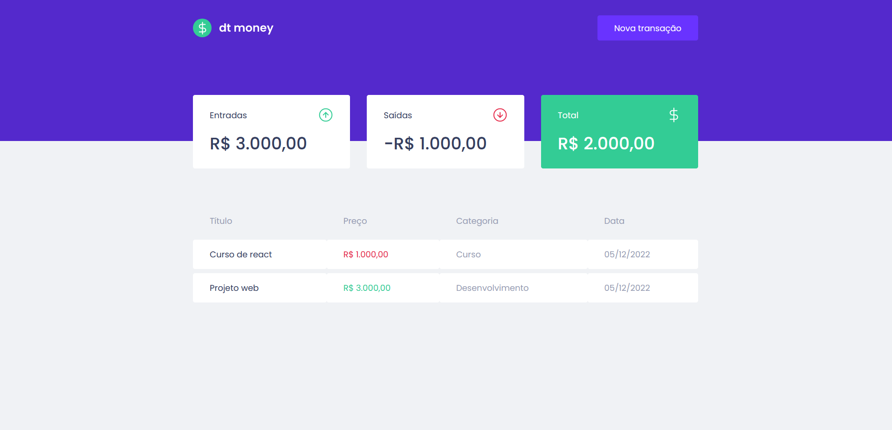
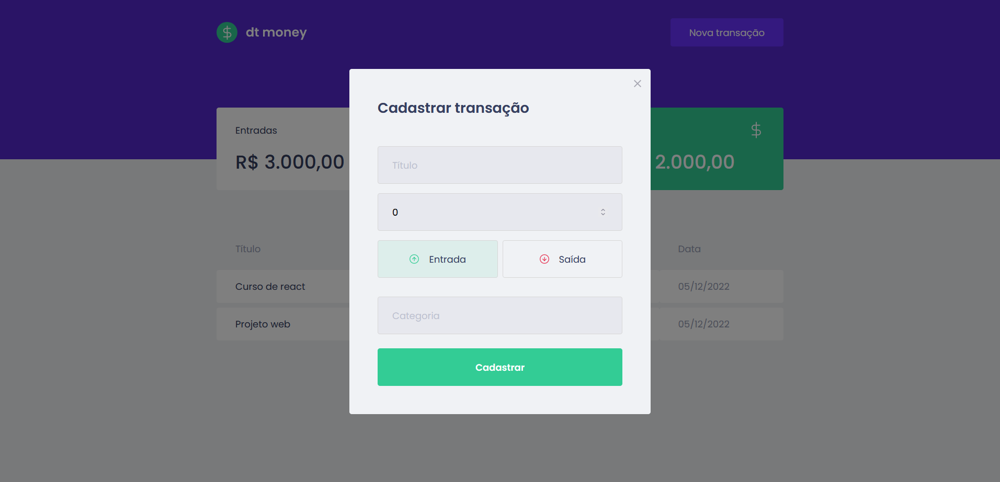

O dtmoney é um fluxo de caixa com entradas e saídas, desenvolvido em ReactJS, durante o curso Ignite da Rocketseat.

## ✅ Funcionalidades

-   Dashboard com o total de Entradas, Saídas e o Total
-   Cadastro de entradas e saídas

## 🛠️ Tecnologias

-   ReactJS
-   React-modal
-   CSS-in-JS com styled-components
-   Typescript
-   Simulação de API com o **MirageJS**
-   Axios

## ❓ Como executar o projeto

_Obs.: Antes você precisa alterar a baseURL do arquivo api.ts, em src/services, que está apontando para a vercel, para a sua url local._

Instalar dependências:

```bash
  yarn

  yarn start
```

## 📸 Screenshots




## Demonstração

Você pode verificar o projeto aqui: https://dtmoney-zeta-two.vercel.app/

## Autores

-   [@barbarapxto](https://www.github.com/barbarapxto)
